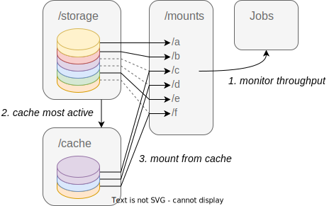

# Scratch manager

Scratch manager is a daemon which automates caching for read only dataset on a system configuration with a slow and a fast storage device.
In a typical HPC environement, the slow storage is a shared network filesystem and the fast one is an ssd drive on the compute node.
It monitors read throughput on a list of dataset stored on a large but slow storage and moves the most active ones to a faster but limited cache storage.
The current implementation uses squashfs images to bundle together the files from each dataset.
This provide the following advantages:

- Large datasets with many small files count as one file on the underlying storage.
- The cache is reused across users and jobs
- Once mounted, dataset content is accessible via the familar posix filesystem api.
- Cached images are mounted over the mountpoint of the non-cached version.
  The transition is seamless for users even if files are currently open.
- The daemon relies on readily available linux io statistics and does not require dependencies other than python 3.


## Principle

The general logic of the code is an infinite loop of the following steps:

1. Check and handle added and deleted datasets
2. Update throughput stats
3. Compute the optimal combination of dataset to cache/drop
4. Unmount and delete datasets to drop from cache
5. Copy and mount dataset to cache




## Usage

The daemon takes 5 arguments:
- `--datadir` the directory containing squashfs image files.
- `--cachedir` the directory to use for caching image files.
- `--mountdir` the directory in under which image files will be mounted, the daemon will create a subdirectory for each image file with the same name without the '.squashfs' extension.
- `--capacity` the maximum allowed cache utilisation (specify the unit from 'GB', 'TB' or '%').
- `--period` the sliding window in seconds over which to aggregate throughput stats.

For convenience, a systemd service template is provided as well.
It can be installed and enabled with:

```
install -D -o root -m 0644 scratch_manager.service /usr/lib/systemd/system/scratch_manager.service
systemctl enable --now scratch_manager.service
```

You can generate an mksquashfs image from a directory using the [mksquashfs](https://manpages.debian.org/testing/squashfs-tools/mksquashfs.1.en.html) command.

Before generating the image, make sure the permissions are correct:
```
find . -type d -exec chmod 0755 {} \;
find . -type f -exec chmod 0644 {} \;
```

We recommend using the follwing options for mksquashfs command:
- `-no-duplicates`: don't try to detect and deduplicate files
- `-no-xattrs`: disable support for extended attributes
- `-no-exports`: disable support for the image being re-exported via nfs
- `-no-sparse`: don't try to detect and optimize sparse files
- `-all-root`: set owner and group to root
- `-progress -info`: show progress bar

Optionally, if the dataset files are alread compressed or you do not want any CPU overhead from reading files:
- `-comp lzo -noD -noF`: disable comrpession of data blocks and fragments and use lzo compression elsewhere


## License

This program is distributed under the CeCILL-C license.


## Known issues

- Older linux kernel versions do not record io stats for disk images.
- The daemon leaves inactive images in cache so long as they do not exceed the quota.
  This reduces the available free space available for other programs.
  It is possible to manually delete cached images but the daemon will eventually reallocate the free space.
- Pre-heating a dataset (forcing it to cache) is not yet implemented.
  It may take a little while until a non-cached dataset gets selected for caching, transfered and mounted.
  During that time data will be readfrom the image stored on the slow storage.
- The daemon is currently single threaded.
  It will hang while dataset images are being transfered or unmounting an image that has open files.